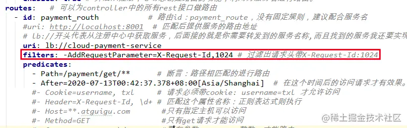

指的是Spring框架中GatewayFilter的实例，使用过滤器，可以在请求被路由前或者之后对请求进行修改。

    Filter链：同时满足一系列的过滤链。
    
    路由过滤器可用于修改进去的HTTP请求和返回的HTTP响应，路由过滤器只能指定路由进行使用。
    SpringCloudGateway内置了多种路由过滤器，他们都由GatewayFilter的工厂类产生。
    
    1.  生命周期
    
        pre
        post
        
    2.  种类
    
        单一的：GatewayFilter
        全局的：GlobalFilter

